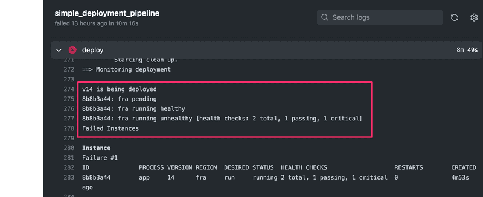

# Full Stack Open - Part 11 - CI/CD - Exercises


## Exercise 11.1.

Before getting our hands dirty with setting up the CI/CD pipeline let us reflect a bit on what we have read. 

### 11.1: Warming up

Think about a hypothetical situation where we have an application being worked on by a team of about 6 people. The application is in active development and will be released soon.

Let us assume that the application is coded with some other language than JavaScript/TypeScript, e.g. in Python, Java, or Ruby. You can freely pick the language. This might even be a language you do not know much yourself.

Write a short text, say 200-300 words, where you answer or discuss some of the points below. You can check the length with [https://wordcounter.net/](https://wordcounter.net). Save your answer to the file named <em>exercise1.md</em> in the root of the repository that you shall create in [exercise 11.2](https://fullstackopen.com/en/part11/getting_started_with_git_hub_actions#exercise-11-2).

The points to discuss:

  *  Some common steps in a CI setup include <em>linting</em>, <em>testing</em>, and <em>building</em>. What are the specific tools for taking care of these steps in the ecosystem of the language you picked? You can search for the answers by google.
  *  What alternatives are there to set up the CI besides Jenkins and GitHub Actions? Again, you can ask google!
  *  Would this setup be better in a self-hosted or a cloud-based environment? Why? What information would you need to make that decision?

Remember that there are no 'right' answers to the above! 


## Exercise 11.2.

In most exercises of this part, we are building a CI/CD pipeline for a small project found in this example [project repository](https://github.com/smartlyio/full-stack-open-pokedex).

### 11.2: The example project

The first thing you'll want to do is to fork the example repository under your name. What it essentially does is it creates a copy of the repository under your GitHub user profile for your use.

To fork the repository, you can click on the Fork button in the top-right area of the repository view next to the Star button:


Once you've clicked on the Fork button, GitHub will start the creation of a new repository called `{github_username}/full-stack-open-pokedex`.

Once the process has been finished, you should be redirected to your brand new repository:


Clone the project now to your machine. As always, when starting with a new code, the most obvious place to look first is the file `package.json`.

**Note:** <em>Since the project is already a bit old, you need Node 16 to work with it!</em>

Try now the following:

  *  install dependencies (by running `npm install`)
  *  start the code in development mode
  *  run tests
  *  lint the code

You might notice that project contains some broken tests and linting errors. **Just leave them as they are for now**. We will get around those later in the exercises.

As you might remember from [Part 3](https://fullstackopen.com/en/part3/deploying_app_to_internet#frontend-production-build), the React code <em>should not</em> be run in development mode once it is deployed in production. Try now the following

  *  create a production <em>build</em> of the project
  *  run the production version locally

Also for these two tasks, there are ready-made npm scripts in the project!

Study the structure of the project for a while. As you notice both the frontend and the backend code is now in the [same repository](https://fullstackopen.com/en/part7/class_components_miscellaneous#frontend-and-backend-in-the-same-repository). In earlier parts of the course we had a separate repository for both, but having those in the same repository makes things much simpler when setting up a CI environment.

In contrast to most projects in this course, the frontend code <em>does not use</em> create-react-app, but it has a relatively simple [webpack](https://fullstackopen.com/en/part7/webpack) configuration that takes care of creating the development environment and creating the production bundle.


## Exercises 11.3.-11.4.

To tie this all together, let us now get GitHub Actions up and running in the example project!

### 11.3: Hello world!

Create a new Workflow which outputs "Hello World!" to the user. For the setup, you should create the directory `.github/workflows` and a file `hello.yml` to your repository.

To see what your GitHub Action workflow has done, you can navigate to the **Actions** tab in GitHub where you should see the workflows in your repository and the steps they implement. The output of your Hello World workflow should look something like this with a properly configured workflow.


You should see the "Hello World!" message as an output. If that's the case then you have successfully gone through all the necessary steps. You have your first GitHub Actions workflow active!

Note that GitHub Actions also informs you on the exact environment (operating system, and its [setup](https://github.com/actions/runner-images/blob/ubuntu18/20201129.1/images/linux/Ubuntu1804-README.md)) where your workflow is run. This is important since if something surprising happens, it makes debugging so much easier if you can reproduce all the steps in your machine!

### 11.4: Date and directory contents

Extend the workflow with steps that print the date and current directory content in long format.

Both of these are easy steps, and just running commands [date](https://man7.org/linux/man-pages/man1/date.1.html) and [ls](https://man7.org/linux/man-pages/man1/ls.1.html) will do the trick.

Your workflow should now look like this


As the output of command `ls -l` shows, by default, the virtual environment that runs our workflow <em>does not</em> have any code!


## Exercises 11.5.-11.9.

### 11.5: Linting workflow

Implement or <em>copy-paste</em> the "Lint" workflow and commit it to the repository. Use a new <em>yml</em> file for this workflow, you may call it e.g. <em>pipeline.yml</em>.

Push your code and navigate to "Actions" tab and click on your newly created workflow on the left. You should see that the workflow run has failed:


### 11.6: Fix the code

There are some issues with the code that you will need to fix. Open up the workflow logs and investigate what is wrong.

A couple of hints. One of the errors is best to be fixed by specifying proper <em>env</em> for linting, see [here](https://fullstackopen.com/en/part3/validation_and_es_lint#lint) how it can be done. One of the complaints concerning `console.log` statement could be taken care of by simply silencing the rule for that specific line. Ask google how to do it.

Make the necessary changes to the source code so that the lint workflow passes. Once you commit new code the workflow will run again and you will see updated output where all is green again:


### 11.7: Building and testing

Let's expand on the previous workflow that currently does the linting of the code. Edit the workflow and similarly to the lint command add commands for build and test. After this step outcome should look like this


As you might have guessed, there are some problems in code...

### 11.8: Back to green

Investigate which test fails and fix the issue in the code (do not change the tests).

Once you have fixed all the issues and the Pokedex is bug-free, the workflow run will succeed and show green!


### 11.9: Simple end to end tests

The current set of tests use [Jest](https://jestjs.io/) to ensure that the React components work as intended. This is exactly the same thing that is done in section [Testing React apps](https://fullstackopen.com/en/part5/testing_react_apps) of Part 5.

Testing components in isolation is quite useful but that still does not ensure that the system as a whole works as we wish. To have more confidence about this, let us write a couple of really simple end to end tests with the [Cypress](https://www.cypress.io/) library similarly what we do in section [End to end testing](https://fullstackopen.com/en/part5/end_to_end_testing) of Part 5.

So, setup Cypress (you'll find [here](https://fullstackopen.com/en/part5/end_to_end_testing) all info you need) and use this test at first:

```
describe('Pokedex', function() {
  it('front page can be opened', function() {
    cy.visit('http://localhost:5000')
    cy.contains('ivysaur')
    cy.contains('Pokémon and Pokémon character names are trademarks of Nintendo.')
  })
})
```

Define a npm script `test:e2e` for running the e2e tests from the command line.

**Note:** Do not include the word <em>spec</em> in the Cypress test file name, that would cause also Jest to run it, and it might cause problems.

**Another thing to note** is that although the page renders the Pokemon names with an initial capital letter, the names are actually written with lower case letters in the source, so you should test for `ivysaur` instead of `Ivysaur`!

Ensure that the test passes locally. Remember that the Cypress tests <blockquote>assume that the application is up and running</blockquote> when you run the test! If you have forgotten the details (that happened to me too!), please see [Part 5](https://fullstackopen.com/en/part5/end_to_end_testing) how to get up and running with Cypress.

Once the end to end test works in your machine, include it in the GitHub Action workflow. By far the easiest way to do that is to use the ready-made action [cypress-io/github-action](https://github.com/cypress-io/github-action). The step that suits us is the following:

```
- name: e2e tests
  uses: cypress-io/github-action@v5
  with:
    command: npm run test:e2e
    start: npm run start-prod
    wait-on: http://localhost:5000
```

Three options are used: [command](https://github.com/cypress-io/github-action#custom-test-command) specifies how to run Cypress tests, [start](https://github.com/cypress-io/github-action#start-server) gives npm script that starts the server, and [wait-on](https://github.com/cypress-io/github-action#wait-on) says that before the tests are run, the server should have started on url [http://localhost:5000](localhost:5000/).

Once you are sure that the pipeline works, <em>write another test</em> that ensures that one can navigate from the main page to the page of a particular Pokemon, e.g. <em>ivysaur</em>. The test does not need to be a complex one, just check that when you navigate to a link, the page has some proper content, such as the string <em>chlorophyll</em> in the case of <em>ivysaur</em>.

**Note:** The Pokemon abilities are written with lower case letters in the source code (the capitalization is done in CSS), so <em>do not</em> test for <em>Chlorophyll</em> but rather <em>chlorophyll</em>.

**NOTE 2:** That you should not try <em>bulbasaur</em>, for some reason the page of that particular Pokemon does not work properly...

The end result should be something like this


End to end tests are nice since they give us confidence that software works from the end user's perspective. The price we have to pay is the slower feedback time. Now executing the whole workflow takes quite much longer.


## Exercises 11.10.-11.12. (Fly.io)

Before going to the below exercises, you should setup your application in [Fly.io](https://fly.io/) hosting service like the one we did in [Part 3](https://fullstackopen.com/en/part3/deploying_app_to_internet#application-to-the-internet).

If you rather want to use other hosting options, there is an alternative set of exercises for [Render](https://fullstackopen.com/en/part11/deployment#exercises-11-10-11-12-render) and for [Heroku](https://fullstackopen.com/en/part11/deployment#exercises-11-10-11-12-heroku).

In contrast to Part 3 now we <em>do not deploy the code</em> to Fly.io ourselves (with the command <em>flyctl deploy</em>), we let the GitHub Actions workflow do that for us!

Create a new app in Fly.io and after that generate a Fly.io API token with command

```
flyctl auth token
```

You'll need the token soon for your deployment workflow!

Before setting up the deployment pipeline let us ensure that a manual deployment with the command <em>flyctl deploy</em> works.

You most likely need to do at least three changes. Firstly, define the Node version to use in the file <em>package.json</em> to match one used in your machine. For me it is 16.19.1:

```
{
  "engines": {     "node": "16.19.1"   },  "name": "fullstackopen-cicd",
  "version": "1.0.0",
  "description": "Full Stack Open",
  // ...
}
```

The configuration file <em>fly.toml</em> should also be modified to include the following:

```
[deploy]
  release_command = "npm run build"

[processes]
  app = "node app.js"

[build]
  [build.args]
    NODE_VERSION = "16.19.1"
```

Besides these, we should also move `webpack` from `devDependencies` to `dependencies` since our build step requires it to be installed:

```
{
  // ...
  "dependencies": {
    "webpack": "^4.43.0",
  }
}
```

The <em>release_command</em> under [deploy](https://fly.io/docs/reference/configuration/) now ensures that the production built will be done before starting up the app. In [processes](https://fly.io/docs/reference/configuration/#the-processes-section) we define the command that starts the application. Without these changes Fly.io just starts the React dev server and that causes it to shut down since the app itself does not start up.

Here the <em>app</em> refers to the application process that is started up in the [services](https://fly.io/docs/reference/configuration/#the-services-sections) section:

```
[[services]]
  http_checks = []
  internal_port = 8080
  processes = ["app"]
```

### 11.10: Deploying your application to Fly.io

Before starting this exercise, make sure that the manual deployment with the command <em>flyctl deploy</em> works!

Extend the workflow with a step to deploy your application to Fly.io by following the advice given [here](https://fly.io/docs/app-guides/continuous-deployment-with-github-actions/).

You need the authorization token that you just created for the deployment. The proper way to pass it's value to GitHub Actions is to use repository secrets:


Now the workflow can access the token value as follows:

```
${{secrets.FLY_API_TOKEN}}
```

If all goes well, your workflow log should look a bit like this:


**Remember** that it is always essential to keep an eye on what is happening in server logs when playing around with product deployments, so use `flyctl logs` early and use it often. No, use it all the time!

### 11.11: Health check and rollback

Each deployment in Fly.io creates a [release](https://fly.io/docs/flyctl/releases/). Releases can be checked from the command line:

```
$ flyctl releases
VERSION	STABLE	TYPE    	STATUS   	DESCRIPTION            	USER           	DATE
v13    	true  	release 	succeeded	Deploy image           	mluukkai@iki.fi	30m6s ago
v12    	true  	release 	succeeded	Deploy image           	mluukkai@iki.fi	51m30s ago
v11    	true  	release 	succeeded	Deploy image           	mluukkai@iki.fi	59m25s ago
v10    	true  	release 	succeeded	Deploy image           	mluukkai@iki.fi	1h6m ago
```

It is essential to ensure that a deployment ends up to a <em>succeeding</em> release, where the app is in healthy functional state. Fortunately Fly.io has several configuration options that take care of the application health check.

The default fly.toml has already a section [services.tcp_checks](https://fly.io/docs/reference/configuration/#services-tcp_checks):

```
  [[services.tcp_checks]]
    grace_period = "1s"
    interval = "15s"
    restart_limit = 0
    timeout = "2s"
```

This section defines a basic health check of the deployment. The TCP check ensures that the virtual machine where the app resides is up and running and reachable from outside, by opening a [TCP](https://en.wikipedia.org/wiki/Transmission_Control_Protocol) connection to the virtual machine.

This check notices if something is fundamentally broken in the configurations. E.g. in my case for the app of this part, it took several trials until I got the app up and running:

```
$ fly releases
VERSION	STABLE	TYPE    	STATUS   	DESCRIPTION            	USER           	DATE
v4     	true  	release 	succeeded	Deploy image           	mluukkai@iki.fi	5h39m ago
v3     	false 	release 	failed   	Deploy image           	mluukkai@iki.fi	5h50m ago
v2     	false 	release 	failed   	Deploy image           	mluukkai@iki.fi	5h57m ago
v1     	false 	release 	failed   	Deploy image           	mluukkai@iki.fi	6h12m ago
v0     	false 	release 	failed   	Deploy image           	mluukkai@iki.fi	6h19m ago
```

So finally in the 5th deployment (version v4) I got the configuration right and that ended in a succeeding release.

Besides the rudimentary TCP health check, it is extremely beneficial to have also some "application level" health checks ensuring that the app for real is in functional state. One possibility for this is a HTTP-level check defined in section [services.http_checks](https://fly.io/docs/reference/configuration/#services-tcp_checks) that can be used to ensure that the app is responding to the HTTP requests.

Add a simple endpoint for doing an application health check to the backend. You may e.g. copy this code:

```
app.get('/health', (req, res) => {
  res.send('ok')
})
```

Configure then a [HTTP-check](https://fly.io/docs/reference/configuration/#services-http_checks) that ensures the health of the deployments based on the HTTP request to the defined health check endpoint.

Note that the default fly.toml has defined that <em>http_checks</em> is an empty array. You need to remove this line when you are adding a manually defined HTTP-check:

```
[[services]]
  http_checks = []
```

It might also be a good idea to have a dummy endpoint in the app that makes it possible to do some code changes and to ensure that the deployed version has really changed:

```
app.get('/version', (req, res) => {
  res.send('1') // change this string to ensure a new version deployed
})
```

Ensure that Actions notices if a deployment breaks your application:



You may simulate this e.g. as follows:

```
app.get('/health', (req, res) => {
  throw 'error...'
  // eslint-disable-next-line no-unreachable
  res.send('ok')
})
```

As can be seen in the command line, when a deployment fails, Fly.io rolls back to the previous working release:

```
$ fly releases
VERSION	STABLE	TYPE    	STATUS   	DESCRIPTION            	USER           	DATE
v15    	true  	rollback	succeeded	Reverting to version 13	               	16m48s ago
v14    	false 	release 	failed   	Deploy image           	mluukkai@iki.fi	21m53s ago
v13    	true  	release 	succeeded	Deploy image           	mluukkai@iki.fi	30m6s ago
v12    	true  	release 	succeeded	Deploy image           	mluukkai@iki.fi	51m30s ago
v11    	true  	release 	succeeded	Deploy image           	mluukkai@iki.fi	59m25s ago
v10    	true  	release 	succeeded	Deploy image           	mluukkai@iki.fi	1h6m ago
```

So despite the problems in the release, the app stays functional!

Before moving to next exercise, fix your deployment and ensure that the application works again as intended.

### 11.12: Custom health check

**Note:** At the moment the custom health check feature in Fly.io does not work. You can mark this exercise done without doing anything. A replacement for this exercise will be developed later...

Besides TCP and HTTP based health checks, Fly.io allows to use very flexible shell script based health checks. The feature is still undocumented but e.g. [this](https://community.fly.io/t/verifying-services-script-checks-is-supported/1464) shows you how to use it.

Create a file <em>health_check.sh</em> with the following content:

```
#!/bin/bash

echo "Hello from shell script"

exit 1 # exit status 1 means that the script "fails"
```

Give it execution permissions (Google or see e.g. [this](https://www.guru99.com/file-permissions.html) to find out how) and ensure that you can run it from the command line:

```
$ ./health_check.sh
Hello from shell script
```

Define a health check to your app that runs the script in the file <em>health_check.sh</em>. Ensure that this health check and deployment fails. After that, change the script as follows:

```
#!/bin/bash

echo "Hello from shell script"

exit 0  # exit status 0 means that the script "succeeds"
```

Ensure now that the deployment works. Note that to get the path to the script file right, it may be beneficial to log in to your virtual machine console to see where the files reside. Logging in is done with the command

```
flyctl ssh console -t YOUR_AUTH_TOKEN
```

Now when you know that the script based health check works, it is time to define the real health check.

<em>Write a script ensuring the health check endpoint (that is, the GET request to '/health') not only works, but also returns the correct string 'ok'.</em>

You probably should use [curl](https://curl.se/) in the script to do the HTTP request. You most likely need to Google how to get hold to the returned string and compare it with the expected value 'ok'.

By default `curl` does not exist in the Fly.io virtual machine. You can install it by adding the following line in the file `Dockerfile` that gets created in your project root directory when Fly.io app is set up:

```
# ...

FROM debian:bullseye

RUN apt-get update; apt install -y curl
LABEL fly_launch_runtime="nodejs"

COPY --from=builder /root/.volta /root/.volta
COPY --from=builder /app /app

WORKDIR /app
ENV NODE_ENV production
ENV PATH /root/.volta/bin:$PATH

CMD [ "npm", "run", "start" ]
```

It is **strongly advisable** to check first locally that the script works since so many things can go wrong in it, and when run in GitHub Action, you can not do any debug printing. If and <em>when</em> things do not work as intended, it is also a very good idea to log in to the virtual machine (with <em>flyctl ssh console</em>) and check that the script works when ran manually there.

**Note** that in order to test the script in the virtual machine, you should have the script in your local directory when you make a successful deployment. So if your deployment fails, the script will not be uploaded to the Fly.io server. So in case of problems, comment out the script based health check from fly.toml and do a deployment to get your script to the virtual machine.

Our script based health check is hardly meaningful in real life since it does essentially the same that is achievable with the simple HTTP check. The example here is just to show that the mechanism exists. Unlike with HTTP checks, with script based health checks you can in principle write an arbitrarily compiled and many sided health check to your app, should you need one.


## Exercises 11.10.-11.12. (Render)

If you rather want to use other hosting options, there is an alternative set of exercises for [Fly.io](https://fullstackopen.com/en/part11/deployment#exercises-11-10-11-12-fly-io) and for [Heroku](https://fullstackopen.com/en/part11/deployment#exercises-11-10-11-12-heroku).

### 11.10: Deploying your application to Render

Set up your application in [Render](https://render.com/). The setup is now not quite as straightforward as in [Part 3](https://fullstackopen.com/en/part3/deploying_app_to_internet#application-to-the-internet). You have to carefully think about what should go to these settings:


If you need to run several commands in the build or start command, you may use a simple shell script for that.

Create eg. a file <em>build_step.sh</em> with the following content:

```
#!/bin/bash

echo "Build script"

# add the commands here
```

Give it execution permissions (Google or see e.g. [this](https://www.guru99.com/file-permissions.html) to find out how) and ensure that you can run it from the command line:

```
$ ./build_step.sh
Build script
```

You also need to open the <em>Advanced settings</em> and turn the auto-deploy off since we want to control the deployment in the GitHub Actions:


Ensure now that you get the app up and running. Use the <em>Manual deploy</em>.

Most likely things will fail at the start, so remember to keep the <em>Logs</em> open all the time.

### 11.11: Automatic deployments

Go now to GitHub Actions [marketplace](https://github.com/marketplace) and search for action for our purposes. You might search with <em>render deploy</em>. There are several actions to choose from. You can pick any. Quite often the best choice is the one with the most stars. It is also a good idea to look if the action is actively maintained (time of the last release) and does it have many open issues or pull requests.

Set up the action to your workflow and ensure that every commit that pass all the checks results in a new deployment. Note that you need Render API key and the app service id for the deployment. See [here](https://render.com/docs/api) how the API key is generated. You can get the service id from the URL of the Render dashboard of your app. The end of the URL (starting with `srv-`) is the id:

```
https://dashboard.render.com/web/srv-crandomcharachtershere
```

Alternatively you could just use [Render Deploy Hook](https://render.com/docs/deploy-hooks) which is a private url to trigger the deployment. You can get it from your app settings:


DON'T USE the plain url in your pipeline. Instead create github secrets for your key and service id: 


Then you can use them like this:

```
    main:
    name: Deploy to Render
    runs-on: ubuntu-latest
    steps:
      - name: Trigger deployment
        run: curl https://api.render.com/deploy/srv-${{ secrets.RENDER_SERVICE_ID }}?key=${{ secrets.RENDER_API_KEY }}
```

The deployment takes some time. See the events tab of the Render dashboard to see when the new deployment is ready:


It might be a good idea to have a dummy endpoint in the app that makes it possible to do some code changes and to ensure that the deployed version has really changed:

```
app.get('/version', (req, res) => {
  res.send('1') // change this string to ensure a new version deployed
})
```

### 11.12: Health check

All tests pass and the new version of the app gets automatically deployed to Render so everything seems to be in order. But does the app really work? Besides the checks done in the deployment pipeline, it is extremely beneficial to have also some "application level" health checks ensuring that the app for real is in a functional state.

Add a simple endpoint for doing an application health check to the backend. You may e.g. copy this code:

```
app.get('/health', (req, res) => {
  res.send('ok')
})
```

Commit the code and push it to GitHub. Ensure that you can access the health check endpoint of your app.

Configure now a <em>Health Check Path</em> to your app. The configuration is done in the settings tab of the Render dashboard.

Make a change in your code, push it to GitHub, and ensure that the deployment succeeds.

Note that you can see the log of deployment by clicking the most recent deployment in the events tab.

When you are set up with the health check, simulate a broken deployment by changing the code as follows:

```
app.get('/health', (req, res) => {
  throw 'error...'
  // eslint-disable-next-line no-unreachable
  res.send('ok')
})
```

Push the code to GitHub and ensure that a broken version does not get deployed and the previous version of the app keeps running.

Before moving on, fix your deployment and ensure that the application works again as intended.


## Exercises 11.10.-11.12. (Heroku)

Before going to the below exercises, you should setup your application in [Heroku](https://fullstackopen.com/en/part11/deployment#exercises-11-10-11-12-heroku) hosting service like the one we did in [Part 3](https://fullstackopen.com/en/part3/deploying_app_to_internet#application-to-the-internet).

If you rather want to use other hosting options, there is an alternative set of exercises for [Fly.io](https://fullstackopen.com/en/part11/deployment#exercises-11-10-11-12-fly-io) and for [Render](https://fullstackopen.com/en/part11/deployment#exercises-11-10-11-12-render).

In contrast to Part 3 now we <em>do not push the code</em> to Heroku ourselves, we let the Github Actions workflow do that for us!

Ensure now that you have [Heroku CLI](https://devcenter.heroku.com/articles/heroku-cli#download-and-install) installed and login to Heroku using the CLI with `heroku login`.

Create a new app in Heroku using the CLI: `heroku create --region eu {your-app-name}`, pick a [region](https://devcenter.heroku.com/articles/regions) close to your own location! (You can also leave the app blank and Heroku will create an app name for you.)

Generate an API token for your Heroku profile using command `heroku authorizations:create`, and save the credentials to a local file but **do not push those to GitHub**!

You'll need the token soon for your deployment workflow. See more information at about Heroku tokens [here](https://devcenter.heroku.com/articles/platform-api-quickstart).

### 11.10: Deploying your application to Heroku

Extend the workflow with a step to deploy your application to Heroku.

The below assumes that you use the ready-made Heroku deploy action [AkhileshNS/heroku-deploy](https://github.com/fullstack-hy2020/misc/blob/master/library-backend.js) that has been developed by the community.

You need the authorization token that you just created for the deployment. The proper way to pass it's value to GitHub Actions is to use repository secrets:


Now the workflow can access the token value as follows:

```
${{secrets.HEROKU_API_KEY}}
```

If all goes well, your workflow log should look a bit like this:


You can then try the app with a browser, but most likely you run into a problem. If we read carefully the section 'Application to the Internet' in [Part 3](https://fullstackopen.com/en/part3/deploying_app_to_internet#application-to-the-internet) we notice that Heroku assumes that the repository has a file called <em>Procfile</em> that tells Heroku how to start the application.

So, add a proper Procfile and ensure that the application starts properly.

**Remember** that it is always essential to keep an eye on what is happening in server logs when playing around with product deployments, so use `heroku logs` early and use it often. No, use it all the time!

### 11.11: Health check

Before moving on let us expand the workflow with one more step, a check that ensures that the application is up and running after the deployment.

Actually a separate workflow step is not needed, since the action [deploy-to-heroku](https://github.com/marketplace/actions/deploy-to-heroku) contains an option that takes care of it.

Add a simple endpoint for doing an application health check to the backend. You may e.g. copy this code:

```
app.get('/health', (req, res) => {
  res.send('ok')
})
```

It might also be a good idea to have a dummy endpoint in the app that makes it possible to do some code changes and to ensure that the deployed version has really changed:

```
app.get('/version', (req, res) => {
  res.send('1') // change this string to ensure a new version deployed
})
```

Look now from the [documentation](https://github.com/marketplace/actions/deploy-to-heroku) how to include the health check in the deployment step. Use the created endpoint for the health check url. You most likely need also the checkstring option to get the check working.

Ensure that Actions notices if a deployment breaks your application. You may simulate this e.g. by writing a wrong startup command to Procfile:


Before moving to next exercise, fix your deployment and ensure that the application works again as intended.

### 11.12: Rollback

If the deployment results in a broken application, the best thing to do is to <em>roll back</em> to the previous release. Luckily Heroku makes this pretty easy. Every deployment to Heroku results in a [release](https://blog.heroku.com/releases-and-rollbacks#releases). You can see your application's releases with the command `heroku releases`:

```
$ heroku releases
=== calm-wildwood-40210 Releases - Current: v8
v8  Deploy de15fc2b  mluukkai@iki.fi  2022/03/02 19:14:22 +0200 (~ 8m ago)
v7  Deploy 8748a04e  mluukkai@iki.fi  2022/03/02 19:06:28 +0200 (~ 16m ago)
v6  Deploy a617a93d  mluukkai@iki.fi  2022/03/02 19:00:02 +0200 (~ 23m ago)
v5  Deploy 70f9b219  mluukkai@iki.fi  2022/03/02 18:48:47 +0200 (~ 34m ago)
v4  Deploy 0b2db00d  mluukkai@iki.fi  2022/03/02 17:53:24 +0200 (~ 1h ago)
v3  Deploy f1cd250b  mluukkai@iki.fi  2022/03/02 17:44:32 +0200 (~ 1h ago)
v2  Enable Logplex   mluukkai@iki.fi  2022/03/02 17:00:26 +0200 (~ 2h ago)
v1  Initial release  mluukkai@iki.fi  2022/03/02 17:00:25 +0200 (~ 2h ago)
```

One can quickly do a [rollback](https://blog.heroku.com/releases-and-rollbacks#rollbacks) to a release with just a single command from commandline.

What is even better, is that the action [deploy-to-heroku](https://github.com/marketplace/actions/deploy-to-heroku) can take care of the rollback for us!

So read again the [documentation](https://github.com/marketplace/actions/deploy-to-heroku) and modify the workflow to prevent a broken deployment altogether. You can again simulate a broken deployment with breaking the Procfile:


Ensure that the application stays still operational despite a broken deployment.

Note that despite the automatic rollback operation, the build fails and when this happens in real life it is <em>essential</em> to find what caused the problem and fix it quickly. As usual, the best place to start finding out the cause of the problem is to study Heroku logs:


## Exercises 11.13.-11.14.

Our workflow is doing a nice job of ensuring good code quality, but since it is run on commits to the main branch, it's catching the problems too late!

### 11.13: Pull request

Update the trigger of the existing workflow as suggested above to run on new pull requests to your main branch.

Create a new branch, commit your changes, and open a pull request to your main branch.

If you have not worked with branches before, check e.g. this [tutorial](https://www.atlassian.com/git/tutorials/using-branches) to get started.

Note that when you open the pull request, make sure that you select here your <em>own</em> repository as the destination <em>base repository</em>. By default, the selection is the original repository by smartly and you **do not want** to do that:


In the "Conversation" tab of the pull request you should see your latest commit(s) and the yellow status for checks in progress:


Once the checks have been run, the status should turn to green. Make sure all the checks pass. Do not merge your branch yet, there's still one more thing we need to improve on our pipeline.

### 11.14: Run deployment step only for the main branch

All looks good, but there is actually a pretty serious problem with the current workflow. All the steps, including the deployment, are run also for pull requests. This is surely something we do not want!

Fortunately, there is an easy solution for the problem! We can add an [if](https://docs.github.com/en/actions/using-workflows/workflow-syntax-for-github-actions#jobsjob_idstepsif) condition to the deployment step, which ensures that the step is executed only when the code is being merged or pushed to the main branch.

The workflow [context](https://docs.github.com/en/actions/learn-github-actions/contexts#contexts) gives various kinds of information about the code the workflow is run.

The relevant information is found in [GitHub context](https://docs.github.com/en/actions/learn-github-actions/contexts#github-context), the field <em>event_name</em> tells us what is the "name" of the event that triggered the workflow. When a pull request is merged, the name of the event is somehow paradoxically <em>push</em>, the same event that happens when pushing the code to the repository. Thus, we get the desired behavior by adding the following condition to the step that deploys the code:

if: ${{ github.event_name == 'push' }}

Push some more code to your branch, and ensure that the deployment step <em>is not executed</em> anymore. Then merge the branch to the main branch and make sure that the deployment happens.


## Exercises 11.15.-11.16.

Let's extend our workflow so that it will automatically increase (bump) the version when a pull request is merged into the main branch and [tag](https://www.atlassian.com/git/tutorials/inspecting-a-repository/git-tag) the release with the version number. We will use an open source action developed by a third-party: [anothrNick/github-tag-action](https://github.com/anothrNick/github-tag-action).

### 11.15: Adding versioning

We will extend our workflow with one more step:

```
- name: Bump version and push tag
  uses: anothrNick/github-tag-action@1.55.0
  env:
    GITHUB_TOKEN: ${{ secrets.GITHUB_TOKEN }}
```

**Note:** You should use the most recent version of the action, see [here](https://github.com/anothrNick/github-tag-action) if a more recent version is available.

We're passing an environmental variable `secrets.GITHUB_TOKEN` to the action. As it is third-party action, it needs the token for authentication in your repository. You can read more [here](https://docs.github.com/en/actions/security-guides/automatic-token-authentication) about authentication in GitHub Actions.

You may end up having this error message:


The most likely cause for this is that your token has no write access to your repo. Go to your repository settings, and select actions/general, and ensure that your token has <em>read and write permissions</em>:


The [anothrNick/github-tag-action](https://github.com/anothrNick/github-tag-action) action accepts some environment variables that modify the way the action tags your releases. You can look at these in the [README](https://github.com/anothrNick/github-tag-action) and see what suits your needs.

As you can see from the documentation by default your releases will receive a `minor` bump, meaning that the middle number will be incremented.

Modify the configuration above so that each new version is by default a `patch` bump in the version number, so that by default, the last number is increased.

Remember that we want only to bump the version when the change happens to the main branch! So add a similar `if` condition to prevent version bumps on pull request as was done in [Exercise 11.14.](https://fullstackopen.com/en/part11/keeping_green#exercises-11-13-11-14) to prevent deployment on pull request related events.

Complete now the workflow. Do not just add it as another step, but configure it as a separate job that [depends](https://docs.github.com/en/actions/using-workflows/about-workflows#creating-dependent-jobs) on the job that takes care of linting, testing and deployment. So change your workflow definition as follows:

```
name: Deployment pipeline

on:
  push:
    branches:
      - master
  pull_request:
    branches: [master]
    types: [opened, synchronize]

jobs:
  simple_deployment_pipeline:
    runs-on: ubuntu-20.04
    steps:
      // steps here
  tag_release:
    needs: [simple_deployment_pipeline]
    runs-on: ubuntu-20.04
    steps:
      // steps here
```

As was mentioned [earlier](https://fullstackopen.com/en/part11/getting_started_with_git_hub_actions#getting-started-with-workflows) jobs of a workflow are executed in parallel but since we want the linting, testing and deployment to be done first, we set a dependency that the <em>tag_release</em> waits the another job to execute first since we do not want to tag the release unless it passes tests and is deployed.

If you're uncertain of the configuration, you can set `DRY_RUN` to `true`, which will make the action output the next version number without creating or tagging the release!

Once the workflow runs successfully, the repository mentions that there are some <em>tags</em>:


By clicking <em>view all tags</em>, you can see all the tags listed:


And if needed, you can navigate to the view of a single tag that shows eg. what is the GitHub commit corresponding to the tag.

### 11.16: Skipping a commit for tagging and deployment

In general the more often you deploy the main branch to production, the better. However, there might be some valid reasons sometimes to skip a particular commit or a merged pull request to becoming tagged and released to production.

Modify your setup so that if a commit message in a pull request contains `#skip`, the merge will not be deployed to production and it is not tagged with a version number.

**Hints:**

The easiest way to implement this is to alter the [if](https://docs.github.com/en/actions/using-workflows/workflow-syntax-for-github-actions#jobsjob_idstepsif) conditions of the relevant steps. Similarly to [Exercise 11.14.](https://fullstackopen.com/en/part11/keeping_green#exercises-11-13-11-14) you can get the relevant information from the [GitHub context](https://docs.github.com/en/actions/learn-github-actions/contexts#github-context) of the workflow.

You might take this as a starting point:

```
name: Testing stuff

on:
  push:
    branches:
      - main

jobs:
  a_test_job:
    runs-on: ubuntu-20.04
    steps:
      - uses: actions/checkout@v2
      - name: github context
        env:
          GITHUB_CONTEXT: ${{ toJson(github) }}
        run: echo "$GITHUB_CONTEXT"
      - name: commits
        env:
          COMMITS: ${{ toJson(github.event.commits) }}
        run: echo "$COMMITS"
      - name: commit messages
        env:
          COMMIT_MESSAGES: ${{ toJson(github.event.commits.*.message) }}
        run: echo "$COMMIT_MESSAGES"
```

See what gets printed in the workflow log!

Note that you can access the commits and commit messages <em>only when pushing or merging to the main branch</em>, so for pull requests the `github.event.commits` is empty. It is anyway not needed, since we want to skip the step altogether for pull requests.

You most likely need functions [contains](https://docs.github.com/en/actions/learn-github-actions/expressions#contains) and [join](https://docs.github.com/en/actions/learn-github-actions/expressions#join) for your if condition.

Developing workflows is not easy, and quite often the only option is trial and error. It might actually be advisable to have a separate repository for getting the configuration right, and when it is done, to copy the right configurations to the actual repository.

It would also be possible to install a tool such as [act](https://github.com/nektos/act) that makes it possible to run your workflows locally. Unless you end using more involved use cases like creating your own [custom actions](https://docs.github.com/en/actions/creating-actions), going through the burden of setting up a tool such as act is most likely not worth the trouble.


## Exercise 11.17.

### 11.17: Adding protection to your main branch

Add protection to your <em>master</em> (or <em>main</em>) branch.

You should protect it to:

  *  Require all pull request to be approved before merging
  *  Require all status checks to pass before merging


## Exercise 11.18.

We have set up a channel <em>fullstack_webhook</em> to the course Discord group at [https://study.cs.helsinki.fi/discord/join/fullstack](https://study.cs.helsinki.fi/discord/join/fullstack) for testing a messaging integration.

Register now to Discord if you have not already done that. You will also need a <em>Discord webhook</em> in this exercise. You find the webhook in the pinned message of the channel <em>fullstack_webhook</em>. Please do not commit the webhook to GitHub!

### 11.18: Build success/failure notification action

You can find quite a few of third party actions from [GitHub Action Marketplace](https://github.com/marketplace?type=actions) by using the search phrase [discord](https://github.com/marketplace?type=actions&query=discord). Pick one for this exercise. My choice was [discord-webhook-notify](https://github.com/marketplace/actions/discord-webhook-notify) since it has quite many stars and a decent documentation.

Setup the action so that it gives two types of notifications:

  *  A success indication if a new version gets deployed
  *  An error indication if a build fails

In the case of an error, the notification should be a bit more verbose to help developers finding quickly which is the commit that caused it.

See [here](https://docs.github.com/en/actions/learn-github-actions/expressions#status-check-functions) how to check the job status!

Your notifications may look like the following:


## Exercise 11.19-11.21.

### 11.9: Periodic health check

We are pretty confident now that our pipeline prevents bad code from being deployed. However, there are many sources of errors. If our application would e.g. depend on a database that would for some reason become unavailable, our application would most likely crash. That's why it would be a good idea to set up a <em>periodic health check</em> that would regularly do an HTTP GET request to our server. We quite often refer to this kind of request as a <em>ping</em>.

It is possible to [schedule](https://docs.github.com/en/actions/using-workflows/events-that-trigger-workflows#schedule) GitHub actions to happen regularly.

Use now the action [url-health-check](https://github.com/marketplace/actions/url-health-check) or any other alternative and schedule a periodic health check ping to your deployed software. Try to simulate a situation where your application breaks down and ensure that the check detects the problem. Write this periodic workflow to an own file.

**Note** that unfortunately it takes quite long until GitHub Actions starts the scheduled workflow for the first time. For me, it took nearly one hour. So it might be a good idea to get the check working firstly by triggering the workflow with Git push. When you are sure that the check is properly working, then switch to a scheduled trigger.

**Note also** that once you get this working, it is best to drop the ping frequency (to max once in 24 hours) or disable the rule altogether since otherwise your health check may consume all your monthly free hours.

### 11.20 Your own pipeline

Build a similar CI/CD-pipeline for some of your own applications. Some of the good candidates are the phonebook app that was built in Parts 2 and 3 of the course, or the blogapp built in Parts 4 and 5, or the Redux anecdotes built in Part 6. You may also use some app of your own for this exercise.

You most likely need to do some restructuring to get all the pieces together. A logical first step is to store both the frontend and backend code in the same repository. This is not a requirement but it is recommended since it makes things much more simple.

One possible repository structure would be to have the backend at the root of the repository and the frontend as a subdirectory. You can also "copy paste" the structure of the [example app](https://github.com/fullstack-hy2020/create-app) of this part or try out the example app mentioned in [Part 7](https://fullstackopen.com/en/part7/class_components_miscellaneous#frontend-and-backend-in-the-same-repository).

It is perhaps best to create a new repository for this exercise and simply copy and paste the old code there. In real life, you most likely would do this all in the old repository but now "a fresh start" makes things easier.

This is a long and perhaps quite a tough exercise, but this kind of situation where you have a "legacy code" and you need to build proper deployment pipeline is quite common in real life!

Obviously, this exercise is not done in the same repository as the previous exercises. Since you can return only one repository to the submission system, put a link of the <em>other</em> repository to the one you fill into the submission form.

### 11.21 Protect your main branch and ask for pull request

Protect the main branch of the repository where you did the previous exercise. This time prevent also the administrators from merging the code without a review.

Do a pull request and ask GitHub user [mluukkai](https://github.com/mluukkai) to review your code. Once the review is done, merge your code to the main branch. Note that the reviewer needs to be a collaborator in the repository. Ping us in Discord to get the review, and to include the collaboration invite link to the message.

**Please note** what was written above, include the link to <em>the collaboration invite</em> in the ping, not the link to the pull request.

Then you are done!


## Submitting exercises and getting the credits

Exercises of this part are submitted via the [submissions system](https://studies.cs.helsinki.fi/stats/courses/fs-cicd) just like in the previous parts, but unlike parts 0 to 7, the submission goes to different "course instance". Remember that you have to finish <em>all the exercises</em> to pass this part!

Your solutions are in two repositories (pokedex and your own project), and since you can return only one repository to the submission system, put a link of the <em>other</em> repository to the one you fill into the submission form!

Once you have completed the exercises and want to get the credits, let us know through the exercise submission system that you have completed the course:


**Note** that you need a registration to the corresponding course part for getting the credits registered, see [here](https://fullstackopen.com/en/part0/general_info#parts-and-completion) for more information.

You can download the certificate for completing this part by clicking one of the flag icons. The flag icon corresponds to the certificate's language.