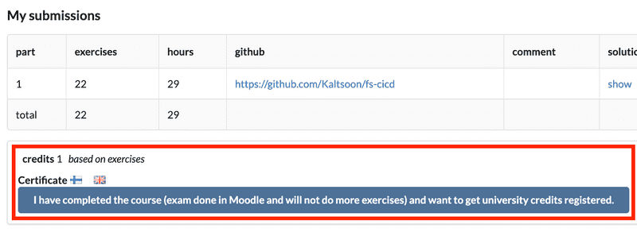

# Full Stack Open - Part 13 - Relational Databases - Exercises


## Exercises 13.1.-13.3.

In the tasks of this section, we will build a blog application backend similar to the tasks in [section 4](https://fullstackopen.com/en/part4), which should be compatible with the frontend in [section 5](https://fullstackopen.com/en/part5) except for error handling. We will also add various features to the backend that the frontend in section 5 will not know how to use.


### Exercise 13.1.

Create a GitHub repository for the application and create a new Fly.io or Heroku application for it, as well as a Postgres database. As mentioned [here](https://fullstackopen.com/en/part13/using_relational_databases_with_sequelize#application-database) you might set up your database also somewhere else, and in that case the Fly.io of Heroku app is not needed.

Make sure you are able to establish a connection to the application database.


### Exercise 13.2.

On the command-line, create a blogs table for the application with the following columns:

  *  id (unique, incrementing id)
  *  author (string)
  *  url (string that cannot be empty)
  *  title (string that cannot be empty)
  *  likes (integer with default value zero)

Add at least two blogs to the database.

Save the SQL-commands you used at the root of the application repository in the file called <em>commands.sql</em>.

### Exercise 13.3.

Create functionality in your application, which prints the blogs in the database on the command-line, e.g. as follows:

```
$ node cli.js
Executing (default): SELECT * FROM blogs
Dan Abramov: 'On let vs const', 0 likes
Laurenz Albe: 'Gaps in sequences in PostgreSQL', 0 likes
```


## Exercise 13.4.

### Exercise 13.4.

Transform your application into a web application that supports the following operations

  *  GET api/blogs (list all blogs)
  *  POST api/blogs (add a new blog)
  *  DELETE api/blogs/:id (delete a blog)


## Exercises 13.5.-13.7.

### Exercise 13.5.

Change the structure of your application to match the example above, or to follow some other similar clear convention.

### Exercise 13.6.

Also, implement support for changing the number of a blog's likes in the application, i.e. the operation

`PUT /api/blogs/:id` (modifying the like count of a blog)

The updated number of likes will be relayed with the request:

```
{
  likes: 3
}
```

### Exercise 13.7.

Centralize the application error handling in middleware as in [Part 3](https://fullstackopen.com/en/part3/saving_data_to_mongo_db#moving-error-handling-into-middleware). You can also enable middleware [express-async-errors](https://github.com/davidbanham/express-async-errors) as we did in [Part 4](https://fullstackopen.com/en/part4/testing_the_backend#eliminating-the-try-catch).

The data returned in the context of an error message is not very important.

At this point, the situations that require error handling by the application are creating a new blog and changing the number of likes on a blog. Make sure the error handler handles both of these appropriately.


## Exercises 13.8.-13.12.

### Exercise 13.8.

Add support for users to the application. In addition to ID, users have the following fields:

  *  name (string, must not be empty)
  *  username (string, must not be empty)

Unlike in the material, do not prevent Sequelize from creating [timestamps](https://sequelize.org/master/manual/model-basics.html#timestamps) <em>created_at</em> and <em>updated_at</em> for users

All users can have the same password as the material. You can also choose to properly implement passwords as in [Part 4](https://fullstackopen.com/en/part4/user_administration).

Implement the following routes

  *  `POST api/users` (adding a new user)
  *  `GET api/users` (listing all users)
  *  `PUT api/users/:username` (changing a username, keep in mind that the parameter is not id but username)

Make sure that the timestamps <em>created_at</em> and <em>updated_at</em> automatically set by Sequelize work correctly when creating a new user and changing a username.

### Exercise 13.9.

Sequelize provides a set of pre-defined [validations](https://sequelize.org/master/manual/validations-and-constraints.html) for the model fields, which it performs before storing the objects in the database.

It's decided to change the user creation policy so that only a valid email address is valid as a username. Implement validation that verifies this issue during the creation of a user.

Modify the error handling middleware to provide a more descriptive error message of the situation (for example, using the Sequelize error message), e.g.

```
{
    "error": [
        "Validation isEmail on username failed"
    ]
}
```

### Exercise 13.10.

Expand the application so that the current logged-in user identified by a token is linked to each blog added. To do this you will also need to implement a login endpoint `POST /api/login`, which returns the token.

### Exercise 13.11.

Make deletion of a blog only possible for the user who added the blog.

### Exercise 13.12.

Modify the routes for retrieving all blogs and all users so that each blog shows the user who added it and each user shows the blogs they have added.


## Exercises 13.13.-13.16.

### Exercise 13.13.

Implement filtering by keyword in the application for the route returning all blogs. The filtering should work as follows

  *  `GET /api/blogs?search=react` returns all blogs with the search word react in the title field, the search word is case-insensitive
  *  `GET /api/blogs` returns all blogs

[This](https://sequelize.org/master/manual/model-querying-basics.html#operators) should be useful for this task and the next one.

### Exercise 13.14.

Expand the filter to search for a keyword in either the <em>title</em> or <em>author</em> fields, i.e. `GET /api/blogs?search=jami` returns blogs with the search word <em>jami</em> in the <em>title</em> field or in the <em>author</em> field

### Exercise 13.15.

Modify the blogs route so that it returns blogs based on likes in descending order. Search the [documentation](https://sequelize.org/master/manual/model-querying-basics.html) for instructions on ordering,

### Exercise 13.16.

Make a route for the application `/api/authors` that returns the number of blogs for each author and the total number of likes. Implement the operation directly at the database level. You will most likely need the [group by](https://sequelize.org/master/manual/model-querying-basics.html#grouping) functionality, and the [sequelize.fn](https://sequelize.org/master/manual/model-querying-basics.html#specifying-attributes-for-select-queries) aggregator function.

The JSON returned by the route might look like the following, for example:

```
[
  {
    author: "Jami Kousa",
    articles: "3",
    likes: "10"
  },
  {
    author: "Kalle Ilves",
    articles: "1",
    likes: "2"
  },
  {
    author: "Dan Abramov",
    articles: "1",
    likes: "4"
  }
]
```

Bonus task: order the data returned based on the number of likes, do the ordering in the database query.


## Exercises 13.17-13.18.

### Exercise 13.17.

Delete all tables from your application's database.

Make a migration that initializes the database. Add <em>created_at</em> and <em>updated_at</em> [timestamps](https://sequelize.org/master/manual/model-basics.html#timestamps) for both tables. Keep in mind that you will have to add them in the migration yourself.

**NOTE:** Be sure to remove the commands <em>User.sync()</em> and <em>Blog.sync()</em>, which synchronizes the models' schemas from your code, otherwise your migrations will fail.

**NOTE 2:** If you have to delete tables from the command line (i.e. you don't do the deletion by undoing the migration), you will have to delete the contents of the <em>migrations</em> table if you want your program to perform the migrations again.

### Exercise 13.18.

Expand your application (by migration) so that the blogs have a year written attribute, i.e. a field year which is an integer at least equal to 1991 but not greater than the current year. Make sure the application gives an appropriate error message if an incorrect value is attempted to be given for a year written.


## Exercises 13.19-13.23.

### Exercise 13.19.

Give users the ability to add blogs on the system to a <em>reading list</em>. When added to the reading list, the blog should be in the <em>unread</em> state. The blog can later be marked as <em>read</em>. Implement the reading list using a connection table. Make database changes using migrations.

In this task, adding to a reading list and displaying the list need not be successful other than directly using the database.

### Exercise 13.20.

Now add functionality to the application to support the reading list.

Adding a blog to the reading list is done by making an HTTP POST to the path <em>/api/reading_lists</em>, the request will be accompanied with the blog and user id:

```
{
  "blogId": 10,
  "userId": 3
}
```

Also modify the individual user route `GET /api/users/:id` to return not only the user's other information but also the reading list, e.g. in the following format:

```
{
  name: "Matti Luukkainen",
  username: "mluukkai@iki.fi",
  readings: [
    {
      id: 3,
      url: "https://google.com",
      title: "Clean React",
      author: "Dan Abramov",
      likes: 34,
      year: null,
    },
    {
      id: 4,
      url: "https://google.com",
      title: "Clean Code",
      author: "Bob Martin",
      likes: 5,
      year: null,
    }
  ]
}
```

At this point, information about whether the blog is read or not does not need to be available.

### Exercise 13.21.

Expand the single-user route so that each blog in the reading list shows also whether the blog has been read <em>and</em> the id of the corresponding join table row.

For example, the information could be in the following form:

```
{
  name: "Matti Luukkainen",
  username: "mluukkai@iki.fi",
  readings: [
    {
      id: 3,
      url: "https://google.com",
      title: "Clean React",
      author: "Dan Abramov",
      likes: 34,
      year: null,
      reading_lists: [
        {
          read: false,
          id: 2
        }
      ]
    },
    {
      id: 4,
      url: "https://google.com",
      title: "Clean Code",
      author: "Bob Martin",
      likes: 5,
      year: null,
      reading_lists: [
        {
          read: false,
          id: 3
        }
      ]
    }
  ]
}
```

Note: there are several ways to implement this functionality. [This](https://sequelize.org/docs/v6/advanced-association-concepts/advanced-many-to-many/#the-best-of-both-worlds-the-super-many-to-many-relationship) should help.

Note also that despite having an array field <em>reading_lists</em> in the example, it should always just contain exactly one object, the join table entry that connects the book to the particular user's reading list.

### Exercise 13.22.

Implement functionality in the application to mark a blog in the reading list as read. Marking as read is done by making a request to the `PUT /api/reading_lists/:id` path, and sending the request with

```
{ "read": true }
```

The user can only mark the blogs in their own reading list as read. The user is identified as usual from the token accompanying the request.

### Exercise 13.23.

Modify the route that returns a single user's information so that the request can control which of the blogs in the reading list are returned:

  *  `GET /api/users/:id` returns the entire reading list
  *  `GET /api/users/:id?read=true` returns blogs that have been read
  *  `GET /api/users/:id?read=false` returns blogs that have not been read


## Exercise 13.24.

### Exercise 13.24.

Grand finale: [towards the end of Part 4](https://fullstackopen.com/en/part4/token_authentication#problems-of-token-based-authentication) there was mention of a token-criticality problem: if a user's access to the system is decided to be revoked, the user may still use the token in possession to use the system.

The usual solution to this is to store a record of each token issued to the client in the backend database, and to check with each request whether access is still valid. In this case, the validity of the token can be removed immediately if necessary. Such a solution is often referred to as a <em>server-side session</em>.

Now expand the system so that the user who has lost access will not be able to perform any actions that require login.

You will probably need at least the following for the implementation

  *  a boolean value column in the user table to indicate whether the user is disabled
      *  it is sufficient to disable and enable users directly from the database

  *  a table that stores active sessions
      *  a session is stored in the table when a user logs in, i.e. operation `POST /api/login`
      *  the existence (and validity) of the session is always checked when the user makes an operation that requires login
  *  a route that allows the user to "log out" of the system, i.e. to practically remove active sessions from the database, the route can be e.g. `DELETE /api/logout`

Keep in mind that actions requiring login should not be successful with an "expired token", i.e. with the same token after logging out.

You may also choose to use some purpose-built npm library to handle sessions.

Make the database changes required for this task using migrations.

## Submitting exercises and getting the credits

Exercises of this part are submitted just like in the previous parts, but unlike parts 0 to 7, the submission goes to an own [course instance](https://studies.cs.helsinki.fi/stats/courses/fs-psql). Remember that you have to finish all the exercises to pass this part!

Once you have completed the exercises and want to get the credits, let us know through the exercise submission system that you have completed the course:



**Note** that you need a registration to the corresponding course part for getting the credits registered, see [here](https://fullstackopen.com/en/part0/general_info#parts-and-completion) for more information.

